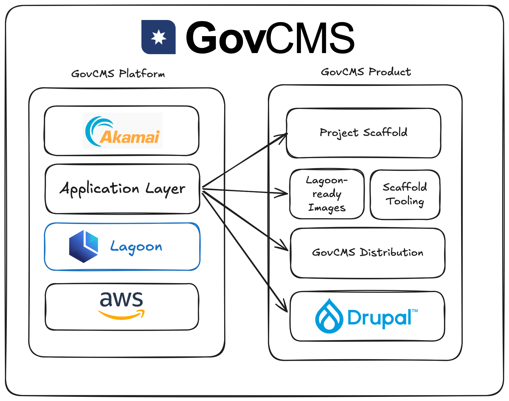

# The GovCMS Platform

The GovCMS platform is a secure, resilient, and scalable cloud hosting platform designed specifically to meet the needs of Australian government entities.
Like all pieces of complex technology, the GovCMS platform is comprised of many layers working in tandem to deliver highly-available cloud application hosting.

## Infrastructure Layer

At the very heart of GovCMS is Amazon Web Services (AWS).
AWS provides the physical computing infrastructure that powers our platform.
In short, when you host an application on GovCMS, it will be physically located on AWS computer hardware in one of their Australian datacentres. 
In particular, we deploy applications inside Kubernetes clusters provided by AWS's Elastic Kubernetes Service (EKS).

### Kubernetes

[Kubernetes](https://kubernetes.io/) is an open source container orchestration system. 
Originally created by Google, it is a powerful tool for the automation of the deployment, scaling, and management of containerised applications, eliminating many of the manual processes involved in running at scale. 
Kubernetes can automatically resolve issues with any container, site or availability zone. 
It also has self-healing capabilities that can ensure automated recovery of individual sites, or in the most extreme case, entire physical data centers (availability zones).

### EKS

As Amazon highlights in their [documentation](https://docs.aws.amazon.com/eks/latest/userguide/what-is-eks.html): 

> EKS is a fully managed Kubernetes service offered by AWS that aims to simplify the complexity of operating Kubernetes clusters. 

GovCMS operates several EKS _clusters_ with differing purposes, from deploying customer applications to hosting many of our own internal services.
Ultimately, when you deploy an application on the GovCMS platform it will end up in one of these clusters.

## Platform Layer

While Kubernetes is a powerful tool, it is equally complex to manage.
Successfully deploying and maintaining an application to Kubernetes requires large amounts of configuration and expert knowledge not directly related to software application development.
To manage this complexity, products have been developed that abstract the process of deploying and maintaining containerised applications in a cluster.
For this, GovCMS uses [Lagoon](https://lagoon.sh/).

### Lagoon

Lagoon is an open-source web application delivery platform for Kubernetes, developed by [Amazee.io](https://amazee.io).
In short, you provide the cluster and your application in the form of a docker-compose file in a Git repository, and Lagoon handles the rest.
While it was originally created to allow for the easy deployment of traditionally non-cloud native applications like CMS such as Drupal, Lagoon is capable of handling most containerisable applications.  

You can learn more about Lagoon [here](./lagoon) or in the [Lagoon documentation](https://docs.lagoon.sh).

## Application Layer

### GitLab

## CDN and WAF Layer

### Akamai
